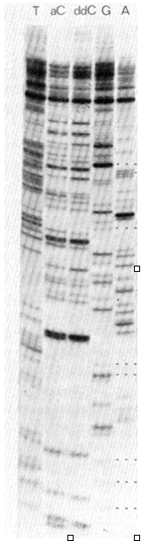

# DNA sequencing {#lesson3}

## Learning Objectives

* Explain the basic approaches to sequencing DNA.
* Use common sequence file formats such as fasta and fastq
* Understand quality scores for base calls 
* Discuss major advances and limitations of second generation sequencing

## Assignment

**1. Read a sequence from the electrophoretic separation of the products of Sanger sequencing. In this image from Fig. 3 of the Sanger et al. (1977) paper, read the sequence yourself for at least 80 nucleotides. Note that there are two different chain termination reactions specific for C. Then look at the sequence in the figure and evaluate how well you read it. What is the most frequent source of errors?**

```{r sanger, echo=F, fig.cap="Adapted from Sanger et al. 1977", fig.align="center"}

```

Reading through the sequence myself is very difficult. The most frequent sources of error are an incorrect base call or incorrect number of nucleotides that make up a polynucleotide track. It's difficult with the gel resolution to interpret how many nucleotides occur in a row before the first change. It's also sometimes difficult to tell whether one band has a greater intensity than another if we look by eye [@sanger-sequencing].

**2. What are the major differences between first generation sequencing (e.g. Sanger sequencing either manually or automated) and second (“next”) generation sequencing. You should discuss both conceptual differences (fundamental differences in approach) and practical consequences.**

The major differences between first and second generation sequencing involve how DNA fragments are isolated, the amplification of genomic material, the sequencing approach, and the method of detection.

In regards to making copies of the genomic material, for first generation sequencing DNA fragments are cloned using plasmids transformed into bacterial colonies and using their machinery to make copies of the engineered vector. For second generation sequencing, DNA fragments are "cloned" *in vitro* using variants of the polymerase chain reaction. As a result, there is no need for plasmid vectors in second generation sequencing nor the need to grow bacterial colonies.

In regards to the sequencing approach, if we look at automated Sanger sequencing and Illumina/Solexa sequencing approaches, they are very similar in that they both utilize the sequencing-by-synthesis approach using fluorescently labeled dNTPs. The major difference in the chemistry involves whether dideoxynucleotides are used. In first generation sequencing, synthesis is terminated once a fluorescently labeled nucleotide is incorporated. However, in second generation sequencing, this is not the case as a fluorescent marker is cleaved when the dNTP is incorporated into the nascent dsDNA fragment. 

This in turn leads us into the difference in detection methodology. In first generation sequencing, electrophoresis is needed to separate the fragments by size and detect the florescent labels found in each fragment following base incorporation. In second generation sequencing, bases are detected "in real time" as they are incorporated at the ends of each fragment for each cycle. The fluorescent signal that comes off as each dNTP is flowed through a flow cell is what the sequencer designates as the incorporated nucleotide.

As a consequence of these difference we see two major differences in the output between the two generations. Although we are able to massively increase the actual amount of DNA molecules that we can "read" in one round of sequencing, the read lengths are much shorter, due to the chemistry of the reactions taking place. While it's common to see read lengths of several hundred and even greater than one thousand nucleotides using first generation sequencing, read lengths are typically on the order of one to three hundred nucleotides using variants of Illumina's platforms.

Pacific Biosciences (PacBio) is a company that utilizes slighty different methodologies and hopes to alleviate this trade off by continuing to offer massively parallel sequencing of many DNA molecules at once without sacrificing read length. The result thus far has been a decrease in the overall output quantified by number of reads, but also a much higher read length, even than first generation methods. However, the new methodology comes with its own trade offs that include a lack of accuracy in individual base calls. This has resulted in most researchers utilizing PacBio in parallel with Illumina to generate high quality draft assemblies and correct for errors in previous sequencing runs. This has been most useful for assembling and annotated genomes.