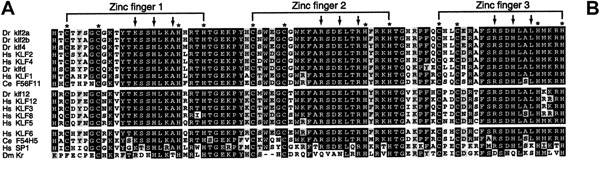
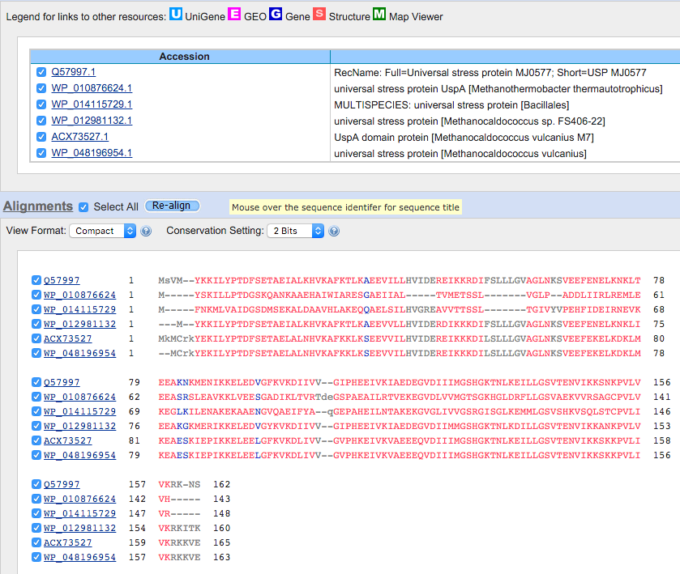

# Aligning biological sequences {#lesson4}

```{r setup, echo = F, comment = F, message = F, warning = F, cache = F}
source("code/lesson4/code.R")
```

## Learning Objectives

* Explain basic approaches to aligning nucleic acid sequences
* Distinguish between local and global alignments
* Apply local and global alignments to different applications
* Develop facility with popular online alignment tools

## Assignment 

Although the assignment asks you to perform the tasks using tools found in Galaxy, the same algorithms are implimented in the R programming language. I will be using strictly R and packages curated by the [Bioconductor](http://bioconductor.org/) community. Considering that Galaxy acts as a wrapper for tools commonly used in R and the command line, I do not expect the results to be different.

First let's import the data into R.

```{r, importData}
seqs <- readAAStringSet(filepath = "_data/lesson4/all.fasta")
```

**1.1 What are the lengths of the four protein sequences?**

To manipulate sequences in R, we can use the [Biostrings][Biostrings] package. To find out the lengths we can use the **width()** function.

```{r, lengths}
for (i in 1:length(seqs)) {cat("Length: ",width(seqs[i])," Name: ", names(seqs[i]),"\n")}
```

**1.2 What is the definition of local alignment and global alignment? How are they different?**

A sequence alignment represents an alignment between two or more sequences of DNA, RNA, or amino acids. There are several ways to align sequences. Two methods for doing so are known as global alignment and local alignment.

**Global Alignment** attempts to align all sequences from end to end of the sequences being compared. This is useful when we are looking to compare highly similar sequences. 

**Local Alignment** attempts to align subsequences within longer sequences that have retained functionally conserved regions or domains whereas less conserved portions of the sequence have lost a majority of their similarity. This is useful when comparing more distantly related sequences that can likely no longer be compared from end to end, but rather only in their most conserved regions.

Local alignment is very similar to global alignment except that we remove the restriction that we need to align the two sequences end to end. There is no pentaly for unaligned sequences surrounding the aligned subsequence. In reference to the traceback path, for a global alignment we follow a path from sink back to the source node that maximizes our score. For a local alignment, we instead set the sink to the highest scoring node and trace back from there to find the source.

**1.3A How do the results of global and local alignment look for orthologous comparisons?**

We can figure this out by comparing two orthologous proteins in our set of sequences. Specifically, we'll look to align Human KLF1 and Mouse KLF1. We can use the **pairwiseAlignment()** function from the Biostrings package.

First we will compare the global alignments. We will use the BLOSUM62 substitution matrix since that is what's used in the EMBOSS suite by default [[Henikoff & Henikoff][Henikoff]]. We will also set the gap opening and gap extension penalties to that of EMBOSS to make sure our results match.

**Global Alignment**

```{r, globalKLF1, cache = F}
human_klf1 <- seqs[4]
mouse_klf1 <- seqs[1]

data(BLOSUM62)
mat <- "BLOSUM62"

galn <- pairwiseAlignment(human_klf1, mouse_klf1, 
                          type = "global", 
                          substitutionMatrix = mat,
                          gapOpening = 10,
                          gapExtension = 0.5)
writePairwiseAlignments(galn, Matrix = mat, block.width = 40)
```

We can easily see that there is a strong relationship between these two sequences based on the very high alignment score and percent identity. Visually we can assess this by noting the vertical black bars that run between matching amino acids.

What does it look like if we do a local alignment?

**Local Alignment**

```{r, localKLF1, cache = F}
laln <- pairwiseAlignment(human_klf1, mouse_klf1, 
                          type = "local",
                          substitutionMatrix = mat,
                          gapOpening = 10,
                          gapExtension = 0.5)
writePairwiseAlignments(laln, Matrix = mat, block.width = 40)
```

What we can see from the results above is that the alignments are almost exactly the same regardless of using global or local alignments for closely related orthologous sequences.

**Using EMBOSS**

Below are the results from using [EMBOSS Needle][EMBOSS Needle].

```
#=======================================
#
# Aligned_sequences: 2
# 1: KLF1_MOUSE
# 2: KLF1_HUMAN
# Matrix: EBLOSUM62
# Gap_penalty: 10.0
# Extend_penalty: 0.5
#
# Length: 366
# Identity:     259/366 (70.8%)
# Similarity:   280/366 (76.5%)
# Gaps:          12/366 ( 3.3%)
# Score: 1356.5
# 
#
#=======================================

KLF1_MOUSE         1 MASAETVLPSISTLTTLGQFLDTQEDFLKWWRSEETQDLGPGPPNPTGPS     50
                     ||:|||.||||||||.||.|.|||:||||||||||.||:|||||:||.|.
KLF1_HUMAN         1 MATAETALPSISTLTALGPFPDTQDDFLKWWRSEEAQDMGPGPPDPTEPP     50

KLF1_MOUSE        51 LHVSLKSEDPSG--EDDERDVTCAWDPDLFLTNFPGSESPGTSRTCALAP     98
                     |||  ||||..|  |||||.....||.||.||||.|.|..|..:||||||
KLF1_HUMAN        51 LHV--KSEDQPGEEEDDERGADATWDLDLLLTNFSGPEPGGAPQTCALAP     98

KLF1_MOUSE        99 SVGPVAQF-EPPESLGAYAGGPGLVTGPLGSEEHTSWAHPTPRPPAPEPF    147
                     |....||: .|||:|||||||||||.|.||||:|:.|..|..|..||:.|
KLF1_HUMAN        99 SEASGAQYPPPPETLGAYAGGPGLVAGLLGSEDHSGWVRPALRARAPDAF    148

KLF1_MOUSE       148 VAPALAPGLAPK-----AQPSYSDSRAGSVGGFFPRAGLAVPAAPGAPYG    192
                     |.|||||..||:     .||.|....|||.||:|||.||:||||.|||||
KLF1_HUMAN       149 VGPALAPAPAPEPKALALQPVYPGPGAGSSGGYFPRTGLSVPAASGAPYG    198

KLF1_MOUSE       193 LLSGYPALYPAPQYQGHFQLFRGLAAPSAGGTAPPSFLNCLGPGTVATEL    242
                     |||||||:||||||||||||||||..|:.|....||||:|||||||.|.|
KLF1_HUMAN       199 LLSGYPAMYPAPQYQGHFQLFRGLQGPAPGPATSPSFLSCLGPGTVGTGL    248

KLF1_MOUSE       243 GATAIAGDAGLSPGTAPPKRSRRTLAPKRQAAHTCGHEGCGKSYSKSSHL    292
                     |.|  |.|.|:...|||.||.||:.|.||||||||.|.||||||:|||||
KLF1_HUMAN       249 GGT--AEDPGVIAETAPSKRGRRSWARKRQAAHTCAHPGCGKSYTKSSHL    296

KLF1_MOUSE       293 KAHLRTHTGEKPYACSWDGCDWRFARSDELTRHYRKHTGHRPFCCGLCPR    342
                     |||||||||||||||:|:||.||||||||||||||||||.|||.|.||||
KLF1_HUMAN       297 KAHLRTHTGEKPYACTWEGCGWRFARSDELTRHYRKHTGQRPFRCQLCPR    346

KLF1_MOUSE       343 AFSRSDHLALHMKRHL    358
                     ||||||||||||||||
KLF1_HUMAN       347 AFSRSDHLALHMKRHL    362


#---------------------------------------
#---------------------------------------
```

Below are the results of [EMBOSS Water][EMBOSS Water].

```
#=======================================
#
# Aligned_sequences: 2
# 1: KLF1_MOUSE
# 2: KLF1_HUMAN
# Matrix: EBLOSUM62
# Gap_penalty: 10.0
# Extend_penalty: 0.5
#
# Length: 366
# Identity:     259/366 (70.8%)
# Similarity:   280/366 (76.5%)
# Gaps:          12/366 ( 3.3%)
# Score: 1356.5
# 
#
#=======================================

KLF1_MOUSE         1 MASAETVLPSISTLTTLGQFLDTQEDFLKWWRSEETQDLGPGPPNPTGPS     50
                     ||:|||.||||||||.||.|.|||:||||||||||.||:|||||:||.|.
KLF1_HUMAN         1 MATAETALPSISTLTALGPFPDTQDDFLKWWRSEEAQDMGPGPPDPTEPP     50

KLF1_MOUSE        51 LHVSLKSEDPSG--EDDERDVTCAWDPDLFLTNFPGSESPGTSRTCALAP     98
                     |||  ||||..|  |||||.....||.||.||||.|.|..|..:||||||
KLF1_HUMAN        51 LHV--KSEDQPGEEEDDERGADATWDLDLLLTNFSGPEPGGAPQTCALAP     98

KLF1_MOUSE        99 SVGPVAQF-EPPESLGAYAGGPGLVTGPLGSEEHTSWAHPTPRPPAPEPF    147
                     |....||: .|||:|||||||||||.|.||||:|:.|..|..|..||:.|
KLF1_HUMAN        99 SEASGAQYPPPPETLGAYAGGPGLVAGLLGSEDHSGWVRPALRARAPDAF    148

KLF1_MOUSE       148 VAPALAPGLAPK-----AQPSYSDSRAGSVGGFFPRAGLAVPAAPGAPYG    192
                     |.|||||..||:     .||.|....|||.||:|||.||:||||.|||||
KLF1_HUMAN       149 VGPALAPAPAPEPKALALQPVYPGPGAGSSGGYFPRTGLSVPAASGAPYG    198

KLF1_MOUSE       193 LLSGYPALYPAPQYQGHFQLFRGLAAPSAGGTAPPSFLNCLGPGTVATEL    242
                     |||||||:||||||||||||||||..|:.|....||||:|||||||.|.|
KLF1_HUMAN       199 LLSGYPAMYPAPQYQGHFQLFRGLQGPAPGPATSPSFLSCLGPGTVGTGL    248

KLF1_MOUSE       243 GATAIAGDAGLSPGTAPPKRSRRTLAPKRQAAHTCGHEGCGKSYSKSSHL    292
                     |.|  |.|.|:...|||.||.||:.|.||||||||.|.||||||:|||||
KLF1_HUMAN       249 GGT--AEDPGVIAETAPSKRGRRSWARKRQAAHTCAHPGCGKSYTKSSHL    296

KLF1_MOUSE       293 KAHLRTHTGEKPYACSWDGCDWRFARSDELTRHYRKHTGHRPFCCGLCPR    342
                     |||||||||||||||:|:||.||||||||||||||||||.|||.|.||||
KLF1_HUMAN       297 KAHLRTHTGEKPYACTWEGCGWRFARSDELTRHYRKHTGQRPFRCQLCPR    346

KLF1_MOUSE       343 AFSRSDHLALHMKRHL    358
                     ||||||||||||||||
KLF1_HUMAN       347 AFSRSDHLALHMKRHL    362


#---------------------------------------
#---------------------------------------
```

It's nice to see that our results match exactly with the implementation of the algorithms in Biostrings. However, there are two (related) differences in the outputs. Numerically, it's the calculation of percent similarity. Visually, this is represented by the periods and colons in the EMBOSS output. These periods and colons represent **conservative** and **semi-conservative** mutations. That is, based on the alignment, these amino acids are assumed to be substitutions. When amino acids of relative chemical similarity align, they can be considered conservative or semi-conservative matches. 

I could not find where in the EMBOSS Needle or Water programs these relationships were defined, but I could find it by looking into the [Clustal Omega documentation](http://www.ebi.ac.uk/Tools/msa/clustalo/help/faq.html#23). Here it tells us that these relationships are defined (for ClustalO) by scores between amino acids in the Gonnet PAM 250 matrix. That is:

> A : (colon) indicates conservation between groups of strongly similar properties - scoring > 0.5 in the Gonnet PAM 250 matrix. A . (period) indicates conservation between groups of weakly similar properties - scoring =< 0.5 in the Gonnet PAM 250 matrix.

Percent similarity is calculated using includes conservative and semi-conservative hits while percent identity only uses exact matches in its calculation. This is why we don't see this output above using Biostrings. However, I plan on writing a function myself to provide R with this functionality as well since it shouldn't be too difficult as long as we define what we mean by "similar."

**Conclusions**

When comparing sequences it's important to consider which type of alignment (global or local), the scoring mechanism (gap open and gap exstension penalties), and the substitution matrices. Above I decided to use the EMBOSS default, BLOSUM62, but there are many other options that depend mostly on the relationship between the two sequences. The PAM substitution matrices were created by [Dayhoff et al.][Dayhoff] and were based on closely related sequences. To compare more distantly related proteins they simply extrapolated outward by multiplying the matrix by itself. Thus, the PAM 250 matrix is a result of multiplying PAM 1 by itself 250 times. In practice however, it was noted that this assumption did not always hold for distantly related proteins and thus the BLOSUM substitution matrix was developed.

For more information comparing the two approaches, there is a helpful [Wikipedia article](https://en.wikipedia.org/wiki/Substitution_matrix).

**1.3B How do the results of global and local alignment look for paralogous comparisons?**

Now that we are interested in paralogous sequences let's look at KLF1 and KLF6 in humans.

**Global Alignment**

```{r, globalHumanKLF6}
human_klf1 <- seqs[4]
human_klf6 <- seqs[3]

data(BLOSUM62)
mat <- "BLOSUM62"

galn <- pairwiseAlignment(human_klf1, human_klf6, 
                          type = "global", 
                          substitutionMatrix = mat,
                          gapOpening = 10,
                          gapExtension = 0.5)
writePairwiseAlignments(galn, Matrix = mat, block.width = 40)
```

We can immediately see that the percent identity is much lower and there are far more gaps when trying to perform a global alignment. If we look closely we can see a highly conserved region towards the end of both proteins. If we had looked for simply the percent identity or similarity using a global alignment, it's unlikely that this comparison would have stood out as significant, highlighting the principle weakness of using global alignment.

**Local Alignment**

```{r, localHumanKLF1}
laln <- pairwiseAlignment(human_klf1, human_klf6, 
                          type = "local", 
                          substitutionMatrix = mat,
                          gapOpening = 10,
                          gapExtension = 0.5)
writePairwiseAlignments(laln, Matrix = mat, block.width = 40)
```

Here we can see that the local alignment gives us a more significant alignment. It highlights the C-terminal end of both proteins, which are known to contain the zinc finger domains common to all KLF proteins [[Suske et al.][Suske]]. We can also see, based on the alignment above, that the highly similar alignment region is about the right length as well.

After playing with the parameters a bit, we get an even better alignment using the code below. Now we can really zoom in on the domains common to both proteins and maximize the percent similarity since we can see that there are relatively few gaps in the alignment above within this region.

```{r, localHumanKLF1edited}
laln <- pairwiseAlignment(human_klf1, human_klf6, 
                          type = "local", 
                          substitutionMatrix = "BLOSUM80",
                          gapOpening = 10,
                          gapExtension = 5)
writePairwiseAlignments(laln, Matrix = mat, block.width = 40)
```

### 1.3C What does this tell you about the conservation in different domains of the proteins?

This tells me that potentially the only region of the protein family that's essential for it to function as a zinc-finger protein are these three domains located near the C-terminal end. You can see that one copy of KFL is longer than another in humans, but the highly conserved domains extend towards the end of the C-terminal end of the protein meaning that the shorter protein lost part of its sequence more towards the N-terminal end where there are potentially non-essential sequences or domains.

It's evident that all three zing-finger domains are conserved between paralogous proteins as is also highlighted in the figure below.

```{r klf-domains, fig.cap="KLF Zinc Finger Multiple Alignment adapted from Oats et al [@klf-zebrafish]", fig.align="center", echo=F}

```

<br>

-----------

<br>

For this exercise I downloaded the sequence for MJ0577 from [Uniprot](http://www.uniprot.org/uniprot/Q57997).

**2.1A How long is the query, and how large is the database?**

The query is 162 amino acids. The database has 29,838,499,437 letters (amino acids) and 81,622,391 sequences.

**2.1B What Matrix was used? Briefly describe.**

By default, the BLOSUM62 matrix was used, which expects these sequences to be 62% identical based on the time since their evolutionary divergence.

**2.2A What are hits to database? What is a high-scoring segment pair (HSP)? What is the relationship between a “hit” and an HSP?**

BLAST is a heuristic that finds similar sequences within a database when compared to a query sequence. The key tradeoff that BLAST optimizes is the relationship between sensitivity and speed due to the fact that running a sensitive local alignment, for example, on every sequence within the NCBI non-redundant protein sequences database would take too long to run. In order to do so it first creates a list of "hits" to the database and then extends those hits into "high scoring segment pairs." 

To create a list of hits it will split your query sequence into "words", W, of a length one can input as a parameter. It will then create another list of "words", W<sup>+</sup>, that match closely enough to the words within your query sequence based on some scoring threshold. It will then scan the database using the words in W<sup>+</sup> for hits.

Not all hits are eventually reported by BLAST because the final step is to extend those hits into what are called high-scoring segment pairs (HSP) based on another scoring threshold, S. These high-scoring segment pairs are what are then reported based on different cutoffs one can set such as an E-score.

**2.2B What conditions must be met before a gapped extension is performed by BLAST2?**

A gapped extension is performed when there are two hits on the same diagonal of your dot plot within a certain distance from one another (in nucleotides) and extending the gap maintains a sufficiently high score.

**2.3 Based on the results from the blast search, what might be the function of this “hypothetical protein MJ0577”? Please report this in your own words. If instead you choose to cut-and-paste from a description on a website, you must put it in quotes, and provide a reference(s) to the web site and any appropriate literature.**

Following the Uniprot link above to find the FASTA protein sequence tells me that the protein is a universal stress protein. I can also easily infer that this might be the case based on many of the HSPs returned by BLAST. NCBI BLAST also has a feature that looks into conserved protein domains found within your query sequence and performs a multiple alignemnt to confirm this hypothesis using closely related species. Below is an image of the multiple alignment.

```{r maln-blast, fig.cap="Multiple Alignment of MJ0577", fig.align="center", echo=F}

```

To learn more about what a universal stress protein (USP) is we can follow this [link](http://www.ncbi.nlm.nih.gov/Structure/cdd/cddsrv.cgi?ascbin=8&maxaln=10&seltype=2&uid=cd00293). Here we learn that USPs are small, cytoplasmic, bacterial proteins that have "enhanced expression" during prolonged exposure to stress.

**2.4 Run a few iterations of PSI-BLAST and describe what happens in terms of discovery of new matches and E values.**

I ran BLAST using the protein sequence for an ApiAP2 protein found in Plasmodium falciparum with the gene ID, PF3D7_1007700. Not much is known regarding this protein except that it has several DNA binding domains and has been implicated in the regulation of invasion-related genes. More information can be found [here on PlasmoDB](http://plasmodb.org/plasmo/showRecord.do?name=GeneRecordClasses.GeneRecordClass&source_id=PF3D7_1007700&project_id=PlasmoDB). 

My first attempt resulted in an error telling me that I had used too many compute resources. What this means, I'm not entirely sure but I think it speaks to the difficulty of having assigned putative functions to this family of transcription factors at all! I decided to use blastp instead of PSI-BLAST, used a BLOSUM45 scoring matrix in order to relax the assumption that the matches I was interested in were highly similar, and filtered low complexity regions due to alignments to those regions not being very meaningful and likely skewing our results.

I received 500 hits (likely the maximum number of hits returned as set by an input parameter), many of which were to other Plasmodium ApiAP2 proteins. Some were found in other sequenced strains of falciparum, some in other species of Plasmodium, and some in other families of Apicomplexan parasites such as Toxoplasma, Bebesia, Eimeria, and Crytosporidium. Much of this is to be expected since we know of may orthologs.

One interesting observation is that if I look at the predicted putative conserved domains on the protein in NCBI BLAST it shows that there are 2 AP2 binding domains. However, if I look on PlasmoDB, as can be found in the literature, there are 3 predicted AP2 DNA binding domains found on this protein. It's been shown by PBM that each of these predicted binding domains due in fact bind double stranded DNA in vitro, but it hasn't yet been shown where in the genome this protein is binding and when. Whether all three domains bind to the genome in vivo and in what combination has yet to be determined.

The publication that first described their existence in Apicomplexans is [Aravind et al.](https://nar.oxfordjournals.org/content/33/13/3994).

## Additional Resources

* [Little Book of R for Bioinformatics - Pairwise Sequence Alignment](http://a-little-book-of-r-for-bioinformatics.readthedocs.org/en/latest/src/chapter4.html)
* [Conservative Mutation](https://en.wikipedia.org/wiki/Conservative_mutation)
* [Biostrings - Pairwise Alignments](https://www.bioconductor.org/packages/3.3/bioc/vignettes/Biostrings/inst/doc/PairwiseAlignments.pdf)
* [Substitution Matrices](http://bip.weizmann.ac.il/education/course/introbioinfo/lect5/scoringmatrices07.pdf)

[Biostrings]:    https://bioconductor.org/packages/release/bioc/html/Biostrings.html   "Biostrings"
[EMBOSS Needle]: http://www.ebi.ac.uk/Tools/psa/emboss_needle/                         "EMBOSS Needle"
[EMBOSS Water]:  http://www.ebi.ac.uk/Tools/psa/emboss_water/                          "EMBOSS Water"   

[Henikoff]:      http://www.pnas.org/content/89/22/10915.long                          "Henikoff and Henikoff"
[Dayhoff]:       http://compbio.berkeley.edu/class/c246/Reading/dayhoff-1978-apss.pdf  "Dayhoff et al."
[Suske]:         http://www.sciencedirect.com/science/article/pii/S088875430500011X    "Suske et al."
