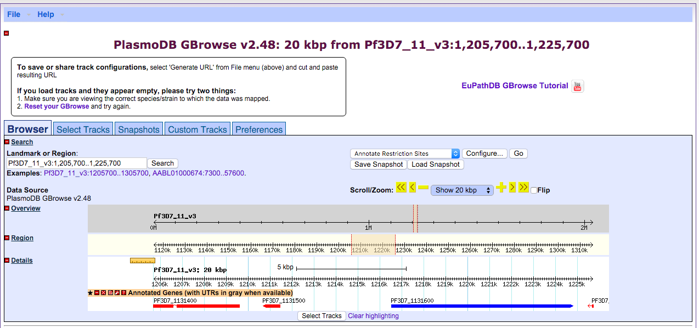
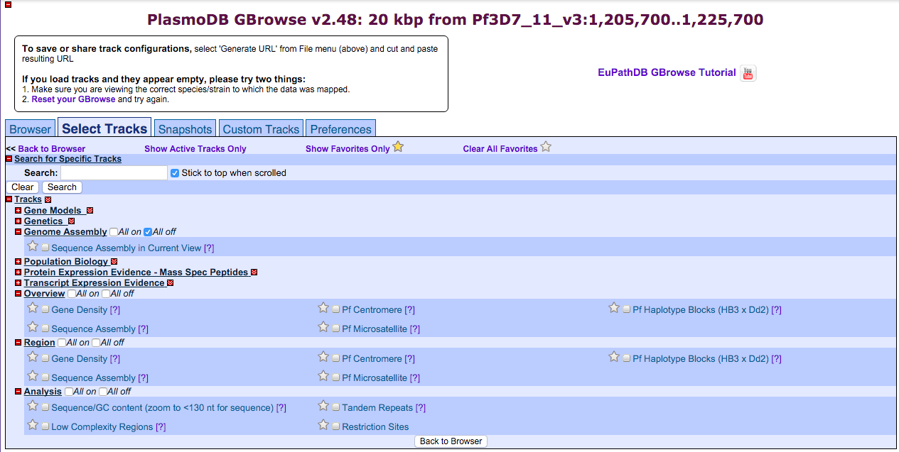
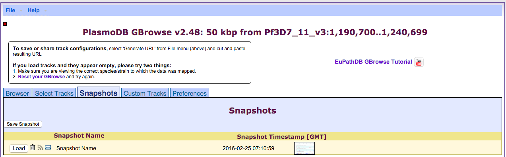
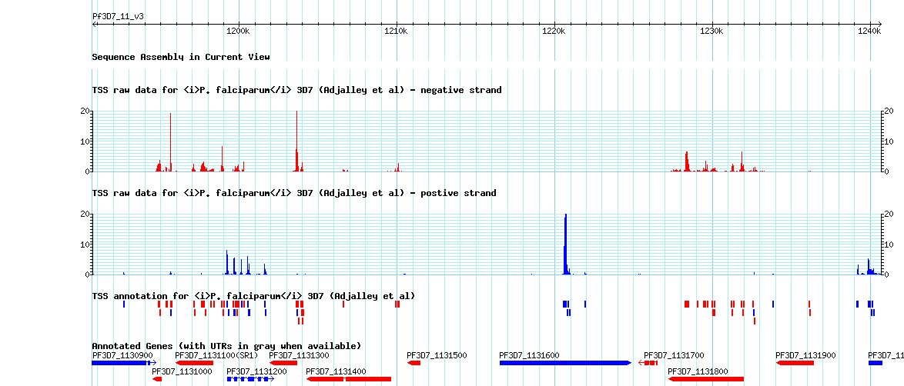

# Genome databases and browsers {#lesson5}

## Learning Objectives

* Identify genomics web resources
* Evaluate what browser to use for the genome of interest
* Use the browswer to navigate the genome of interest

## Assignment

For this assignment I will go over the features of the [PlasmoDB](http://plasmodb.org/) genome browser, which can be used to explore the genomes of multiple species of *Plasmodium* parasites.

**Technology**

The genome browser found on PlasmoDB is built on top of the [GBrowse](http://gmod.org/wiki/GBrowse) open source framework. In other words, it's a web-based genome browser unlike [IGV](https://www.broadinstitute.org/igv/), for example. On the backend there is a database server that can be used to access datasets similar to the way that you would access datasets using the UCSC genome browser.

```{r plasmodb, echo=F, fig.caption="Default view of PlasmoDB Genome Browser", fig.align="center"}

```

**Data accessibility**

The data on PlasmoDB is not raw data, although the sources of the raw data are usually provided. In most cases PlasmoDB will process the data in some way in order to standardize it. Typically, updated annotations and sequence assemblies are taken from the latest updates on [GeneDB](http://www.genedb.org/Homepage), which is where the *Plasmodium* genomes are currently curated. This update occurs every several months, whereas the most up-to-date data sets can typically be found on GeneDB. The latest version of PlasmoDB is version 27, which was released on February 19th, 2016. 

**Genome Assemblies**

Currently the only available genome assembly is the well curated draft genome of the 3D7 strain of *Plasmodium falciparum*. The first draft assembly was published in 2002 [[Gardner et al.]](http://www.ncbi.nlm.nih.gov/pubmed/12368864) and contains no ambiguous base pairs at this point. While there are many other assemblies available for download in FASTA format on both PlasmoDB and GeneDB, they are not currently as complete as the 3D7 reference strain and thus aren't available using the PlasmoDB genome browser. One would have to download them separately and view them in IGV.

**Data tracks**

Similar to UCSC genome browser, one can select different tracks to be viewed at the same time, stacked on top of one another in order to compare a variety of data at once. Available tracks from recent publications include, but aren't limited to, various strand-specific RNA-seq data, nucleosome occupancy data, and SNP data. These tracks are presented as annotation tracks or coverage tracks. 

```{r data-tracks, echo=F, fig.caption="Different tracks one can choose from", fig.align="center"}

```

**Additional features**

Additional features include the ability to take snapshots to be exported and used in figures. You can directly email them or download them. Unfortunately you are limited to exporting saved snapshots in PNG format, which isn't ideal or creating figures if that is your end goal.

```{r snapshot1, echo=F, fig.caption="Taking and exporting a snapshot", fig.align="center"}

```

Last but not least, one can also add custom tracks by text, URL, or a local file. These can be in various formats including BAM, BigWig, GFF, and BED. The custom tracks get added just like any other track would and can be saved onto your account so you can load it any time you login.

```{r snapshot2, echo=F, fig.caption="Snaphshot example including additional tracks showing predicted TSSs and associated stranded coverage data track", fig.align="center"}

```
