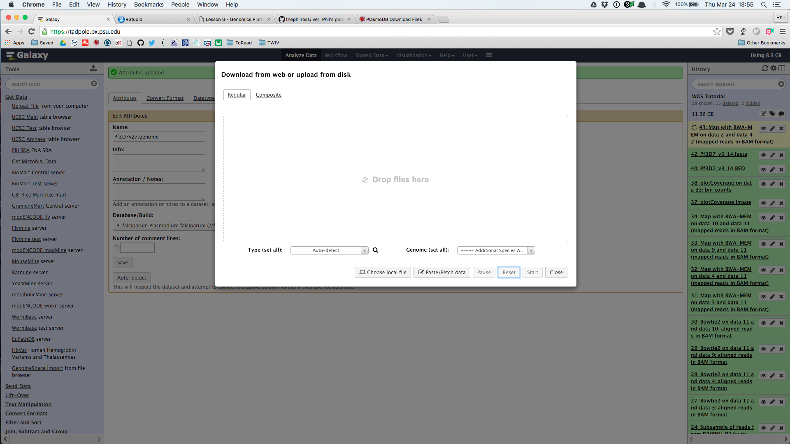
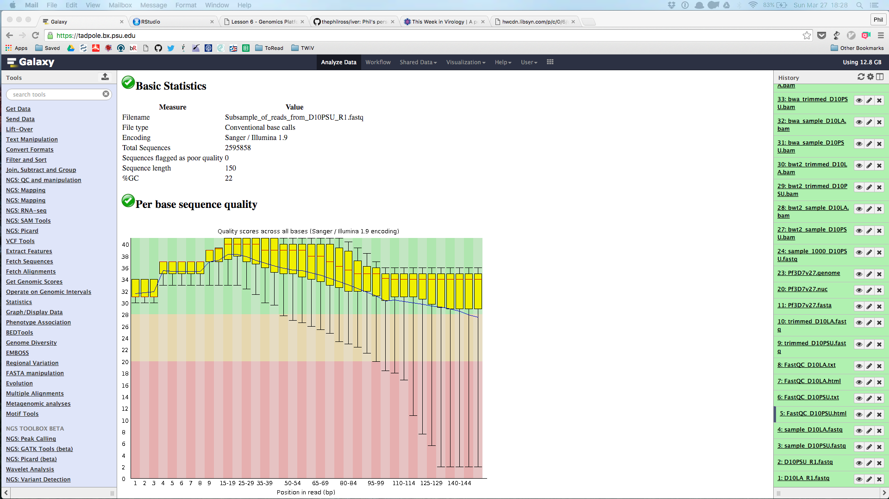
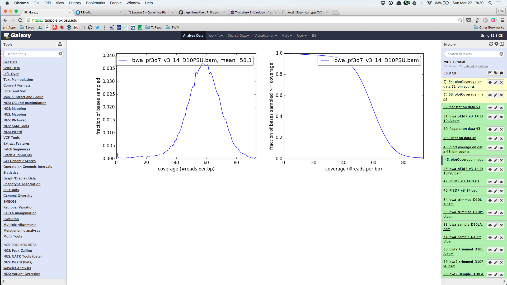

# Genomics platforms {#lesson6}

## Learning Objectives

* Become familiar with more tools and capabilities of Galaxy
* Analyze genomic data using different tools

## Assignment 

To analyze data using Galaxy I used a Pennsylvania State University specific instance known as [Tadpole](https://tadpole.bx.psu.edu/). One needs an account to access it, but **it does not use any tools that cannot be installed from the main [Galaxy Toolshed](https://toolshed.g2.bx.psu.edu/).** Thus, any tools that I explain I used can also be found in the [main Galaxy instance](https://usegalaxy.org/).

Now let's get started.

**Analysis of Chromosome 14 of P. falciparum**

To demonstrate the utility of Galaxy I will show off a few tools that one can use to analyze Illumina whole genome sequencing data. This data was generated sepcifically on a HiSeq 2500 and is composed of 150 base-pair single-end reads. In order to keep it simple, we'll just map the reads to chromosome 14 of the *Plasmodium falciparum* 3D7 reference genome.

**Downloading the data**

We can download the multi-FASTA file that contains the sequences for the reference genome from **[PlasmoDB](http://plasmodb.org/plasmo/)**. We'll use the genome found under [version 27](http://plasmodb.org/common/downloads/release-27/Pfalciparum3D7/fasta/data/PlasmoDB-27_Pfalciparum3D7_Genome.fasta). We need to download our FASTA file beforehand because Tadpole does not have locally cached genome files. Not a problem, since these genomes are relatively small and building an index on the fly does not take much time.

**Uploading the data**

Next we will look under "Get Data" and use the "Upload File" tool to load our genome file into our history.

```{r upload-file, echo=F, fig.cap="Upload File Tool", fig.align="center"}

```

We will also upload our FASTQ files which are stored as a **[Data Library](https://wiki.galaxyproject.org/Admin/DataLibraries/Libraries)** on the Tadpole instance. A Data Library provide containers for data sets in Galaxy. An administrator needs to make it available to specific users prior to this being an option for the average user, but once that's done, you have the option of loading those data sets directly into your history. Because the data set is already loaded into Galaxy this process is very fast and efficient. This especially useful if you want to automate the process of data retrieval and accessibility or if you want to share this data with other members of the same lab or collaborators.

**Quality control**

The next step in any NGS analysis is to somehow quantify different quality control measures for our raw reads. Questions we might be interested in include the quality of our base calls at each position (since these are Illumina reads each read is of the same length), the nucleotide content distribution, or whether there is possible contamination. A very useful and efficient tool for looking into these and many more potential issues is **[FastQC](http://www.bioinformatics.babraham.ac.uk/projects/fastqc/)**. In Figure 2 we can see that most of our quality metrics look alright we can move ahead to mapping these reads to our reference without performing any additional process such as trimming.

```{r fastqc, echo=F, fig.cap="FastQC Plot", fig.align="center"}

```

**Mapping reads to a reference using BWA-MEM**

Next we need to decide which short read mapper we want to use to map our reads to the genome. Galaxy provides us with several options, two of which are very common: **[Bowtie2](http://bowtie-bio.sourceforge.net/bowtie2/index.shtml)** and **[BWA-MEM](http://bio-bwa.sourceforge.net/bwa.shtml)**. We'll use BWA-MEM here because it's slightly faster using the default parameters. Depending on the size of your data set this can take several hours to several weeks! Luckily, the Plasmodium genome is relatively small and we're only interested in one chromosome so this will likely only take a few hours.

**Checking our mapping results using samtools**

We can initially check how many of our reads mapped successfully to the genome using samtools. Many other tools can be used as well, but samtools is very efficient and information-lite. It's a perfect first pass of our data. The results are below:

```{r,eval = F}
13363234 + 0 in total (QC-passed reads + QC-failed reads)
0 + 0 duplicates
4613751 + 0 mapped (34.53%:-nan%)
0 + 0 paired in sequencing
0 + 0 read1
0 + 0 read2
0 + 0 properly paired (-nan%:-nan%)
0 + 0 with itself and mate mapped
0 + 0 singletons (-nan%:-nan%)
0 + 0 with mate mapped to a different chr
0 + 0 with mate mapped to a different chr (mapQ>=5)
```

The mapping percentages here look bad, but they're actually quite high considering that the actual sample is taken from the entire genome! The whole genome is made of 16 total contigs (including one mitochondrial and one apicoplast genome). Of the 14 nuclear chromosomes, chromosome 14 is indeed the largest and thus should get the largest number of reads. The real question is how many reads should it get? The reference genome has 23332831 base pairs. Chromosome 14 has 3291936 base pairs. This leads to chromosome 14 containing 14.1% of the total number of base pairs in the genome. And yet we see here that 34.53% of the reads map to chromosome 14!

It's too soon to speak for whether this is to be expected or not. Additional things to look into are the average mapping quality of the reads and how many of them are multi-mapped reads. It's possible also that any read that is mapping to a paralog present on another chromosome is now mapping to chromosome 14 since it is the closest thing to the fragment from which the read was derived.

**Coverage distribution**

Another good way of performing quality control on your alignment file is to plot a histogram of the coverage distribution. A great tool for that is **[deepTools](http://deeptools.readthedocs.org/en/latest/) plotCoverage**. This will provide us not only with a plot of the genome coverage distribution, but also can tell us the mean coverage of our alignment file.

```{r coverage, echo=F, fig.cap="Coverage Distribution", fig.align="center"}

```

**All done!**

There's a quick tutorial on mapping single-end short reads to a reference genome using Galaxy.
