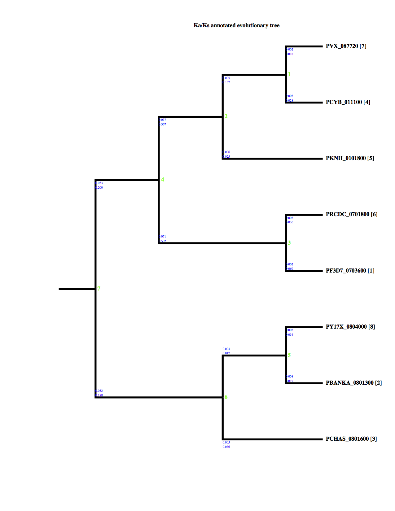
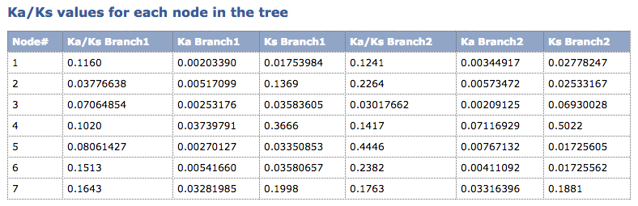

# Comparative genomices {#lesson9}

## Learning Objectives

* Distinguish neutral evolution, negative selection, and positive selection
* Interpret alignments of genomic DNA sequences as showing evidence of evolutionary constraint or adaptation, distinguishing both from evidence consistent with neutral evolution.
* Show how you can use genome comparisons between species to estimate the amount of functional sequence – and to identify it
* Understand the basics of several tests for selection or scores that estimate likelihood of being under selection
    * Ka/Ks test
    * phastCons
    * Extended haplotype homozygosity
* Understand the connection between gene duplication and adaptive evolution

## Notes

> "Functionally less important molecules or parts of a molecule evolve faster than more important ones."
> — Kimura and Ohta (1974) PNAS USA 71: 2848-2852

## Assignment

### Background

In Woo et al. [@chromerids] they make note of a statistically significant relationship between a gene encoding striated fiber assemblin (SFA), Cvel_872, and several host-cell invasion protein encoding genes in *P. falciparum*. Their analysis showed correlated expression patterns between various orthologues gene groups, or orthogroups, looking at various apicomplexan species and the single-celled red algae, *Chromera velia*. The most significant overlap between orthogroups occured between *Chromera velia* and *P. falciparum*. SFA is a key protein for organizing the basal bodies of the flagellar apparatus in algae and the apical complexes in apicomplexans. Thus, they suggest that, in *Chromera velia*, some of the genes implicated in the invasion process of modern apicomplexans were functionally associated with those implicated in flagellar motility.

### Design

I decided to analyze the evolutionary signatures present in the homologue of Cvel_872 in various *Plasmodium* species. 

### Methods

The gene IDs for the those genes are as follows:

* PF3D7_0703600 (human)
* PBANKA_0801300 (mouse)
* PCHAS_0801600 (mouse)
* PCYB_011100 (macaque)
* PKNH_0101800 (macaque & human)
* PRCDC_0701800 (chimpanzee)
* PVX_087720 (human)
* PY17X_0804000 (mouse)

Vertebrate host species known to be infected by the above parasites with which each gene is associated with are in parentheses.

The sequences were extracted from [PlasmoDB](http://plasmodb.org/plasmo/) on July 11th, 2016 from the latest version (28). Following, data acquisition, rate of substitutions at synonymous and nonsynonymous sites were analyzed using the Ka/Ks Calculation tool found at [http://services.cbu.uib.no/tools/kaks](http://services.cbu.uib.no/tools/kaks).

### Results

#### Multiple sequence alignment

Although the actual multiple sequence alignment was done using the server listed within the methods section, we can use the Bioconductor package, [msa](https://bioconductor.org/packages/release/bioc/html/msa.html) to visualize it for us here. We can see that we have very few loci that are variable, even at the DNA level, for this gene.

```{r msa-sfa,fig.align="center",fig.caption="Multiple sequence alignment of SFA homologs in selected Plasmodium species",results=""}
sshhh("msa")
seqs <- readDNAStringSet("_data/lesson9/OG5_136181_CDS.fasta")
aln <- msa(seqs)
print(aln, showNames=TRUE, show="complete")
```

#### Phylogenetic tree

The phylogenetic tree is consistent with the phylogeny estimated in Woo et al. and with what's known about *Plasmodium* evolution [@Liu_2010@Liu_2014].

```{r kaks-tree, echo=F, fig.cap="Annotated phylogenetic tree", fig.align="center"}

```

#### Ka / Ks values

The first thing to consider when evaluating the Ka / Ks ratios are whether the alignment was made between genes that are 1:1 homologs of one another. While there are multiple SFA genes within some *Plasmodium* spcecies, such as *falcparum*, they underwent an expansion prior to the the evolution of the proto-*Plasmodium* ancestor. Thus, these genes represent 1:1 homologs when comparing only *Plasmodium* species.

```{r kaks-table, echo=F, fig.cap="Calculated Ka / Ks ratios for an SFA-derived gene in Plasmodium parasites", fig.align="center"}

```

We can see from the results that 
